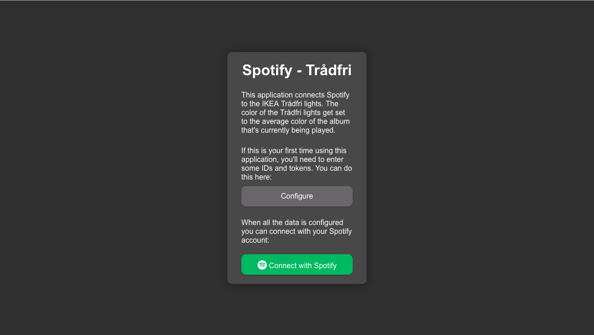
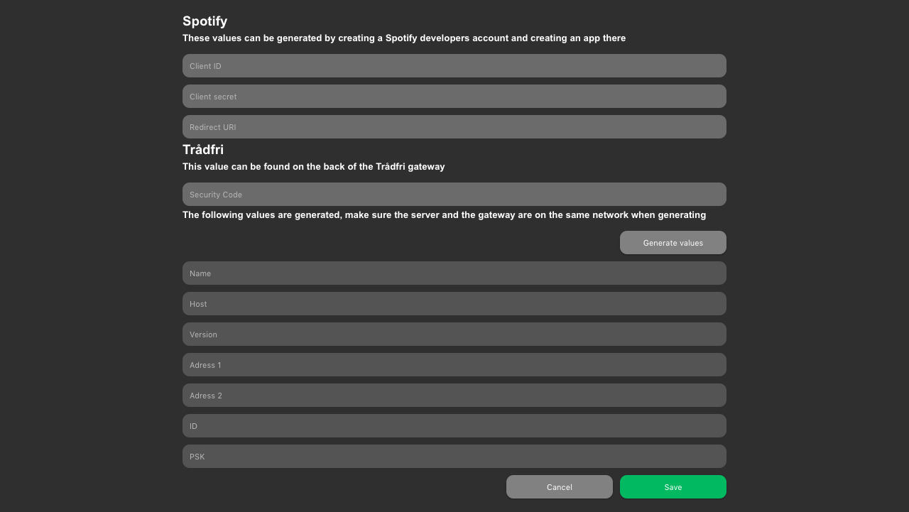
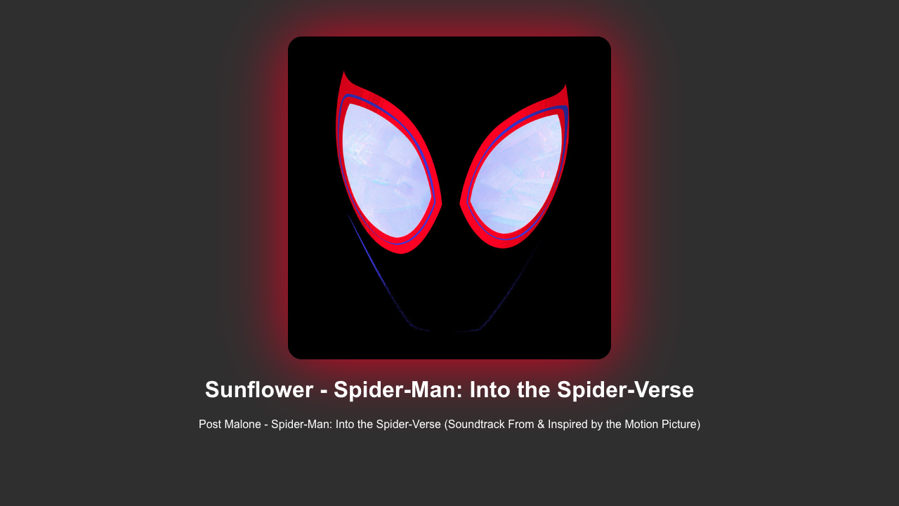

# Spotify - Trådfri
A rather crappy app that gives you an interface that shows what's currently being played on your Spotify account (as if Spotify doesn't already do that lol). It also connects to your Trådfri gateway so it can match your lightbulbs to the album cover's most saturated color. I created this app for fun so don't expect it to work perfectly or look fantastic or whatever.

### Installation and start

##### Back-end

1. Open a terminal and navigate to the base directory
2. Install the dependencies: `npm install`
3. Start the server: `node server`

##### Front-end

1. Open a terminal and navigate to the directory: 'spotify-tradfri-frontend'
2. Install the dependencies: `npm install`
3. Start the front-end: `npm start`
4. Navigate to: http://localhost:3000

### The interface

##### Homepage

The homepage of the app gives some information about the application. If this is your first time using the app you have to fill in some data on the configuration page. When this is done you can connect with Spotify. This button redirects you to a login page from Spotify.

##### Configuration page

On the configuration page you can fill in all the data that is needed to initialize Spotify and Trådfri. You can get the Spotify data by creating an app with a developers account: [Spotify Developers](https://developer.spotify.com/dashboard/login). The security code, found on the bottom of your Trådfri gateway, is the only thing that you need to fill in. The rest of the data will be generated when clicking the "Generate values" button. For this your back-end needs to be on the same network as the gateway. 

##### Playing page

After filling in all configuration data you can connect with Spotify. The playing page now shows what's being played on your Spotify account. The background of this page is the color that is being sent to the Trådfri lights every second.

### F.A.Q.

##### Wow, your code is really crappy. Wtf?

Yeah I'm lazy and didn't feel like cleaning it up. You should've seen version one lol.

#####The UI is very ugly man, how come?

I'm not a designer, I'm a developer.

##### Why are you creating a F.A.Q. section even though no one will ever read it?

Because I felt like it.  